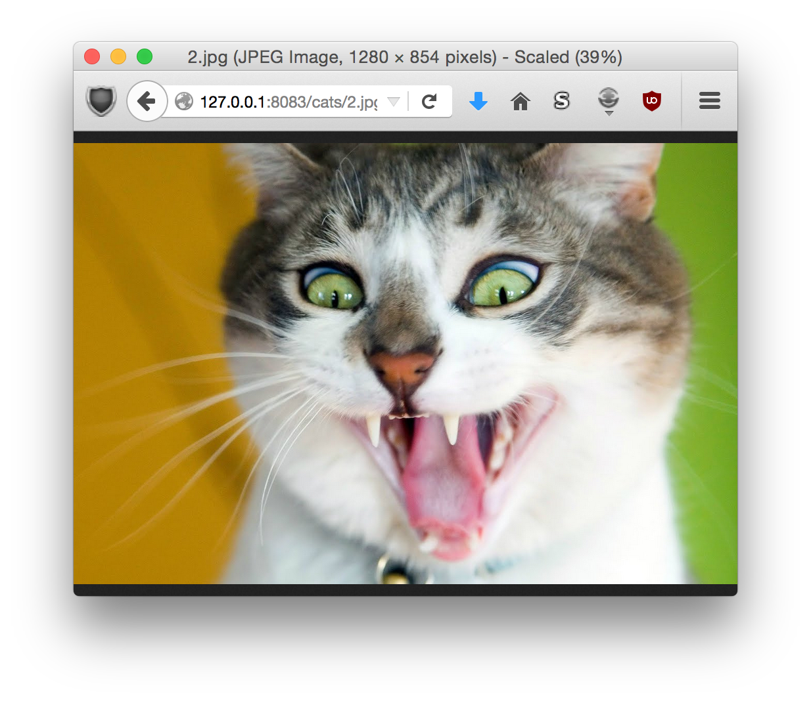
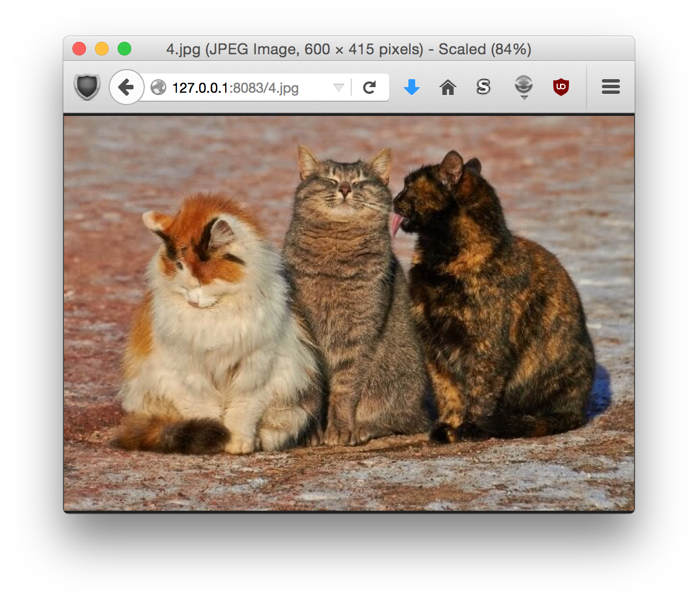

# Creating your first Suave webpage

``` fsharp
[<EntryPoint>]
let main argv =
  startWebServer defaultConfig ``Hello World``.hi // => "Hello World"
  0
```

In one terminal


In another:

```
➜  ~  curl http://127.0.0.1:8083 -i
HTTP/1.1 200 OK
Server: Suave/0.31.2.0 (http://suave.io)
Date: Thu, 15 Oct 2015 19:23:49 GMT
Content-Type: text/html
Content-Length: 13

Goodbye World
```

# Browsing for Files

First have a look at `filesInHome`. Try requesting `http://127.0.0.1:8083/`;

```
➜  06-Web git:(master) ✗ curl http://127.0.0.1:8083 -i
curl: (52) Empty reply from server
```

Then

```
➜  06-Web git:(master) ✗ curl http://127.0.0.1:8083/cats/1.jpg -i
HTTP/1.1 200 OK
Server: Suave/0.31.2.0 (http://suave.io)
Date: Thu, 15 Oct 2015 19:44:08 GMT
Content-Type: image/jpeg
Vary: Accept-Encoding
Last-Modified: Thu, 15 Oct 2015 21:42:21 GMT
Content-Length: 91697

BINARY-CONTENT ELUDED
```

Try it in your browser!


Another



Change to

```
let main argv =
  startWebServer defaultConfig allCats
  0
```

You can easily read the list of files in your browser by having a look at the / endpoint again:

``` bash
➜  06-Web git:(master) ✗ curl http://127.0.0.1:8083/ -i
HTTP/1.1 200 OK
Server: Suave/0.31.2.0 (http://suave.io)
Date: Thu, 15 Oct 2015 20:11:36 GMT
Content-Type: text/html
Content-Length: 270

10/15/2015 9:33:27 PM                91697 1.jpg<br/>
10/15/2015 9:34:42 PM                90084 2.jpg<br/>
10/15/2015 9:34:55 PM               109419 3.jpg<br/>
10/15/2015 9:35:23 PM                70747 4.jpg<br/>
10/15/2015 9:35:46 PM                68924 5.jpg<br/>
```


Or you can 'jump into' the 'cats' folder and serve from there:

```
let servedCats = Files.browse catDir

let main argv =
  startWebServer defaultConfig servedCats
  0
```



```
➜  06-Web git:(master) ✗ curl http://127.0.0.1:8083/4.jpg -i
HTTP/1.1 200 OK
Server: Suave/0.31.2.0 (http://suave.io)
Date: Thu, 15 Oct 2015 20:17:00 GMT
Content-Type: image/jpeg
Vary: Accept-Encoding
Last-Modified: Thu, 15 Oct 2015 22:16:52 GMT
Content-Length: 70747

BINARY-CONTENT ELUDED
```

## Http.fs

The Http module is filled with nicely documented applicatives; just start typing in Xamarin Studio, and you'll get Code Completion to help you:


The main ones are:

 - Response - response and response_f functions.
 - Writers - ways to modify the response
 - Intermediate - 100 and 101 response codes
 - Successful- 2xx response codes.
 - Redirection - 3xx response codes.
 - RequestErrors - 4xx response codes.
 - ServerErrors - 5xx response codes.
 - Applicatives - use to filter down the request to something you want.
 - Files - send files to the client
 - Authentication - Methods for authenticating http requests

E.g. if you want to send a 302 temporary redirect:

``` fsharp
Redirection.FOUND "/another-location"
```

As such, you can re-use your existing HTTP knowledge with Suave.

If you want a quick primer, have a browse through [Suave.Http.fsi](https://github.com/SuaveIO/suave/blob/master/src/Suave/Http.fsi) where all the documentation is laid out in the code.

# Introducing Routing and Applicatives

# Lazy

## /stale

```
➜  06-Web git:(master) ✗ curl http://127.0.0.1:8083/stale
2015-10-16T12:14:08.3246040+00:00       
```

A little later

```
➜  06-Web git:(master) ✗ curl http://127.0.0.1:8083/stale
2015-10-16T12:14:08.3246040+00:00
```

## /fresh

```
➜  06-Web git:(master) ✗ curl http://127.0.0.1:8083/fresh
2015-10-16T12:14:25.8878250+00:00
```

A little later

```
➜  06-Web git:(master) ✗ curl http://127.0.0.1:8083/fresh
2015-10-16T12:14:43.4012830+00:00
```

# Using a server side template

Follow the code

# Developing with JavaScript

In the last chapter you got an introduction to what it's like to do server-side templating. While doing server-side templating is a stable, common pattern, more and more web developers are starting to use NPM and write JS-only web sites that interact with an API.

Let's have a look at some pros and cons. In favor of server-side templating:

 - Renders fast in the browser
 - Good for SEO, but this is beginning to change
 - If you have back- vs front-end developers then your backend developers easily do this work
 - It's a known model
 - You can hide your API from outsiders

In favor of client-side templating and single-page apps:

 - Browsers are very fast at executing JS nowadays
 - Doing request-reply on every page interaction is slower than letting JS show the change and wait for the API to return OK behind the scenes, which may lead to a better user experience
 - Your API is clearly deliniated and can be published for others to consume
 - You get access to a wider community of people who make things; the JS community is very large
 - You're going to have to write JS to some extent anyway, so why not make the client-side bits all-JS?
 - You can use a modern JS compiler infrastructure like WebPack and Babel
 - If you want to package the site as an offline application later, it's easier

In this course we're going to show how to use WebPack and Babel.

Have a look in `src/public`.


# Writing client-side JavaScript apps

Now that we know what WebPack looks like, let's have a look at how to write Hello World in ReactJS, which is the chosen client-side technology for this course.


